CS5374 Homework3
===

* Group: io_uring

Kernel Configuration
---

We change the preemption model to **Voluntary Kernel Preemption (Desktop)** (CONFIG_PREEMPT_VOLUNTARY). This avoids RCU's CPU stalls warning since **Preemptible Kernel** (CONFIG_PREEMPT) will also enable CONFIG_PREEMPT_RCU which will cause problems if real-time tasks do not give up their CPUs.

For further details, please see <https://www.kernel.org/doc/Documentation/RCU/stallwarn.txt>

We can also observe RCU's CPU stalls warning when using Linux's built-in rt scheduler with RT throttling disabled.

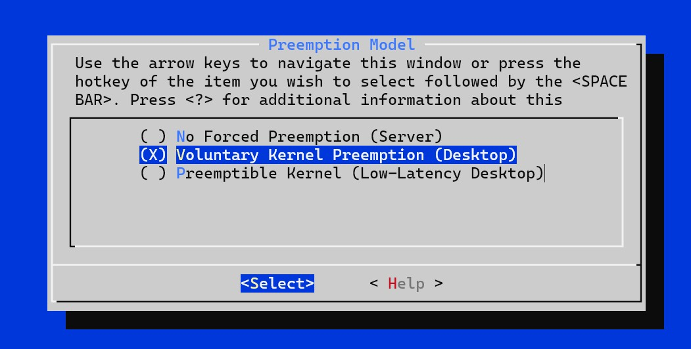

`checkpatch.pl` Warning Related to `printk`
---

It seems that `checkpatch.pl` always warns if we use `printk`. We used a macro to wrap the `printk` in our implementation to minimize the number of warnings. However, we still need to use `printk` as it is a good tool to trace our scheduler behavior and this is essential to conduct our experiments. We also find that there are many uses of `printk`s in `kernel/sched/core.c`.

The suggestion that  `checkpatch.pl` provides is to use the function (which wraps `printk`) that the subsystem which our code belongs to provided. However, it seems that the scheduler subsystem do not provide their own `printk` equivalent functions.

Implementation Details
---

In this assignment, we are required to create a new scheduler class `sched_mlq_class` for a new scheduling policy `SCHED_MLQ`.

To add a new scheduling policy in linux kernel, we have to do some modification in linux kernel source code.

In `include/asm-generic/vmlinux.lds.h` 

```c=
	__begin_sched_classes = .;		\
	*(__idle_sched_class)			\
	*(__fair_sched_class)			\
	*(__mlq_sched_class)           \
	*(__rt_sched_class)			\
	*(__dl_sched_class)			\
	*(__stop_sched_class)			\
	__end_sched_classes = .;
```

The order of these addresses is important, since they are used to determine the order of the priority of each scheduler class.

In `include/uapi/linux/sched.h`

```c=
/*
 * Scheduling policies
 */
#define SCHED_NORMAL		0
#define SCHED_FIFO		1
#define SCHED_RR		2
#define SCHED_BATCH		3
/* SCHED_ISO: reserved but not implemented yet */
#define SCHED_IDLE		5
#define SCHED_DEADLINE		6
#define SCHED_MLQ       7
```

In `kernel/sched/sched.h`

```c=
static inline int mlq_policy(int policy)
{
	return policy == SCHED_MLQ;
}

...
    
extern const struct sched_class stop_sched_class;
extern const struct sched_class dl_sched_class;
extern const struct sched_class rt_sched_class;
extern const struct sched_class mlq_sched_class;
extern const struct sched_class fair_sched_class;
extern const struct sched_class idle_sched_class;
```

In `kernel/sched/Makefile`, to compile `kernel/sched/mlq.c`

```
obj-y += idle.o fair.o rt.o deadline.o mlq.o
```

We define some basic structures (schedule entiry and run queue) for MLQ scheduler.

```c=
struct sched_mlq_entity {
	struct list_head	run_list;
	s64			time_slice;
	u64 			exec_start;
	bool			on_rq;
};


struct mlq_rq {
	struct list_head	queue[3];
	struct task_struct 	*curr;
	unsigned int		nr_running;

	/* Following are used for throttling */
	struct hrtimer		throttle_timer;
	s64			exec_time;
	s64			sleep_time;
	s64			last_check_time;
	bool			is_throttled;
	bool			throttling_enabled;
};

```

In these two structures, `run_list` and `queue[3]` are simply linked-list. Our MLQ scheduler uses linked-list as the implementation of run queue, `queue[0]` and `queue[1]` uses Round-Robin (RR) algorithm with different time slices and `queue[2]` uses First-Come-First-Serve (FCFS) algorithm.

The data members in `struct mlq_rq` such as `throttle_timer`, `exec_time`, `sleep_time`, `last_check_time`, `is_throttled` and `throttling_enabled` are used for real-time throttling mechanism, which will be discussed later.

After modifying some headers and defining the basic structures, we dig into the implementation detail of MLQ scheduler. First, we have to define an schedule class interface in `kernel/sched/mlq.c`

```c=
DEFINE_SCHED_CLASS(mlq) = {

    .enqueue_task       = enqueue_task_mlq,
    .dequeue_task       = dequeue_task_mlq,
    .yield_task         = yield_task_mlq,

    .check_preempt_curr = check_preempt_curr_mlq,
    
    .pick_next_task     = pick_next_task_mlq,
    .put_prev_task      = put_prev_task_mlq, 
    .set_next_task      = set_next_task_mlq,

#ifdef CONFIG_SMP
    .balance     	    = balance_mlq,
    .select_task_rq     = select_task_rq_mlq,
    .pick_task          = pick_task_mlq,
    .migrate_task_rq    = migrate_task_rq_mlq,
    .task_woken         = task_woken_mlq,
    .set_cpus_allowed   = set_cpus_allowed_common,

    .rq_online          = rq_online_mlq,
    .rq_offline         = rq_offline_mlq,

    .find_lock_rq       = NULL,
#endif

    .task_tick          = task_tick_mlq,
	/*
	 * The switched_from() call is allowed to drop rq->lock, therefore we
	 * cannot assume the switched_from/switched_to pair is serialized by
	 * rq->lock. They are however serialized by p->pi_lock.
	 */
	.switched_from      = switched_from_mlq,
    .switched_to        = switched_to_mlq,

	.prio_changed       = prio_changed_mlq,
    .update_curr        = update_curr_mlq,
};
```

This data structure `sched_class` is composed of many function pointers which are directly related to the operation of `schedule()` function. Also, the priority assignment of MLQ scheduler is implicitly defined in the functions.

### enqueue_task_mlq

Check the priority to determine the time slice of current queue. If the priority is 1, the time slice is 50ms. If the priority is 2, the time slice is 100ms. After that, append the task to the specific run queue. Also, the `nr_running` data member should be increased. This function will be called when a new task is created through fork() system call or when a task wakes up from sleep.

### dequeue_task_mlq

Simply remove the task from the specific run queue, and decrease `nr_running` data member in the run queue. Happen when a task goes to sleep waiting for a lock or IO event.

### yield_task_mlq

The function is used when the current task leaves the CPU. In real-time task, the implementation is very simple. All we have to do is requeue the current task.

### pick_next_task_mlq

It is called by the core scheduler to determine which task should be running next. The kernel would context switch to the selected task. 

### pick_task_mlq

The function is called by `pick_next_task_mlq`. Simply pick a task in MLQ run queue by priority. If there are no tasks in high priority queue, then it will pick a task from lower priority queue.

### put_prev_task_mlq

The function is called when a task is being taken off from the CPU. In our implementation, it updates the current time slice and execution time of a task in MLQ scheduler.

### set_next_task_mlq

This function is generally used to update some task’s metadata. In our implementation, the function updates the sleep time of a task with boundary checking.

### select_task_rq_mlq

The core scheduler invokes this function to figure out which CPU to assign a task to. It is possible to assign a task CPU affinity so that it runs on particular cores.

### task_tick_mlq

The function updates the task execution time and checks if it exceeds the pre-defined time slice for Round-Robin (RR) algorithm. For tasks which are priority 3 (FCFS algorithm), we don't need to consider this function.

### switch_to_mlq

The core scheduler context switches from other scheduler classes to MLQ scheduler. It will trigger a `resched_curr()` function call if the task `p` is on the run queue.

### prio_changed_mlq

When the priority of a task changes, the function will be called and trigger a `resched_curr()` function call if the task `p` is on the run queue.

Test System Calls
---

In this section, we will discuss about how to test the system calls mentioned in the homework spec. There are total 8 system calls to test, `sched_setscheduler`, `sched_getscheduler`, `sched_serparam`, `sched_getparam`, `sched_getpriority_min`, `sched_getpriority_max`, `sched_setaffinity` and `sched_getaffinity`. We provide 7 test programs to test these system calls.

    ├── Makefile
    ├── getaffinity.c
    ├── getparam.c
    ├── getprio.c
    ├── getsched.c
    ├── setaffinity.c
    ├── setparam.c
    └── setsched.c

### sched_setscheduler / sched_getscheduler

* sched_setscheduler sets the scheduling policy of specified process to MLQ scheduler, and assign a priority to the process. 
* sched_getscheduler gets the process's scheduling policy, we expect that the system will return 7 (SCHED_MLQ).
* 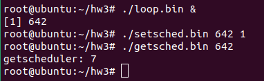

### sched_setparam / sched_getparam

* sched_setparam sets the scheduling priority of specified process, the pre-defined range of priority of MLQ scheduler is between 1 and 3. If the number is not in the range, it will return an error. 
* sched_getparam gets the scheduling priority of specified process, the priority we got should be the same as what we set.
* 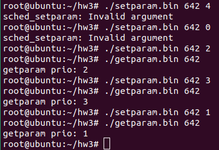

### sched_getpriority_min / sched_getpriority_max

* sched_getpriority_min gets the minimum priority of MLQ scheduler, while sched_getpriority_max gets the maximum priority of MLQ scheduler.

* To achieve the requirement, we modified the definition of these two system calls.

* 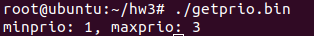

  ```c=
  SYSCALL_DEFINE1(sched_get_priority_min, int, policy)
  {
      int ret = -EINVAL;
      switch (policy) {
      case SCHED_FIFO:
      case SCHED_RR:
          ret = 1;
          break;
      case SCHED_MLQ:
          ret = 1;
          break;
      case SCHED_DEADLINE:
      case SCHED_NORMAL:
      case SCHED_BATCH:
      case SCHED_IDLE:
          ret = 0;
      }
      return ret;
  }
  ```

  ```c=
  SYSCALL_DEFINE1(sched_get_priority_max, int, policy)
  {
      int ret = -EINVAL;
      switch (policy) {
      case SCHED_FIFO:
      case SCHED_RR:
          ret = MAX_RT_PRIO-1;
          break;
      case SCHED_MLQ:
          ret = 3;
          break;
      case SCHED_DEADLINE:
      case SCHED_NORMAL:
      case SCHED_BATCH:
          ret = 0;
          break;
      }
      return ret;
  }
  ```

### sched_setaffinity / sched_getaffinity

* sched_setaffinity sets the CPU affinity for specific process by passing a `cpu_set_t` structure and use macros `CPU_ZERO` and `CPU_SET` to assign cpuid to the structure.
* sched_getaffinity gets the CPU affinity for specific process by iterating through all available cpuids. It is able to get all online cpuids from `long nproc = sysconf(_SC_NPROCESSORS_ONLN)`, then we can check whether CPU affinity is set by `CPU_ISSET` macro.
* The critical functions in linux kernel which are directly associated with this system call are`set_cpus_allowed_common` and `select_task_rq_mlq`, which is defined in `kernel/sched/core.c` and `kernel/sched/mlq.c`
* There are 2 cores in the qemu virtual machine, so we basically set the cpuid to 0 and 1, the `sched_getaffinity` should return the corresponding cpuid.
* 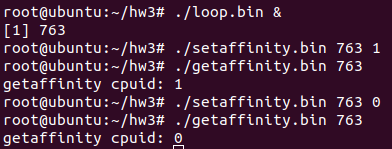


Trace-printk
---

* enable below config to enable Ftrace.

```shell=
scripts/config --enable CONFIG_FTRACE
scripts/config --enable CONFIG_TRACING
scripts/config --enable CONFIG_TRACING
scripts/config --enable CONFIG_FUNCTION_TRACER
scripts/config --enable CONFIG_FUNCTION_GRAPH_TRACER\n
scripts/config --enable CONFIG_DYNAMIC_FTRACE
scripts/config --enable CONFIG_STACK_TRACER
```

* replace `prink` with `trace_printk`
* mount debugfs to get the debug info

```shell=
debugfs /sys/kernel/debug debugfs defaults
```

* can check the `trace_printk` message in `/sys/kernel/debug/tracing/trace`

However, we think that `printk` is easier to use because it is possible to configure Linux to output the messages in kernel ring buffers to console directly by using `dmesg -n 8`. Therefore, we use `printk` to trace the behavior of our scheduler instead of using `trace_printk`.

Bonus: real-time throttling
---

Running tasks with real-time priority is dangerous if the tasks never give up its CPUs. Usually, real-time tasks are high-priority tasks that will be run as soon as possible when some events happen, but they should not occupy the CPUs for a long time.

However, if the tasks are buggy, they may block the entire system if they do not give up their CPU time.

To solve this problem, Linux has a mechanism to throttle the CPU that real-time tasks can use. We also want to implement this mechanism in our MLQ scheduler.

We define two constants:

```c=
#define MLQ_RUNTIME_NS 950000000
#define MLQ_SLEEP_NS    50000000
```

The MLQ runqueue will be throttled if their runtime reaches `MLQ_RUNTIME_NS` ns. However, the runtime resets if the runqueue sleeps (meaning that the runqueue has no tasks) every `MLQ_SLEEP_NS` ns.

To implement this, we add some members to the `struct mlq_rq`:

```c=
	struct hrtimer		throttle_timer;
	s64			exec_time;
	s64			sleep_time;
	s64			last_check_time;
	bool			is_throttled;
	bool			throttling_enabled;
```

- `throttling_enabled` indicated that whether the throttling mechanism should be enabled.
- `is_throttled` means that whether the MLQ runqueue is being throttled or not.
- `last_check_time` is the last absolute time that we calculate `exec_time` and `sleep_time`.
- `exec_time` is the accumulated runtime. It resets whenever `sleep_time` reaches `MLQ_SLEEP_NS` or the throttling period ends.
- `sleep_time` is the accumulated sleep time. It resets whenever `sleep_time` reaches `MLQ_SLEEP_NS` or the throttling period ends.


When the `exec_time` reaches `MLQ_RUNTIME_NS`, the throttling will be start. `is_throttled` will be set to `true`, and `pick_next_task_mlq` will just return `NULL` when MLQ is being throttled. An hrtimer will also be queued and will be expired when the throttling period ends. The callback of the hrtimer resets `exec_time`, `sleep_time` and `is_throttled`, marking the end of the throttling period.


To enable the throttling mechnism, please append `mlq_throttling` to the kernel command line.

When MLQ is being throttled, an message `MLQ: Throttling for xxx ns` will be outputed to the kernel ring buffer.

When running an infinite loop without any sleeps with MLQ, you will see the message in the kernel ring buffer.

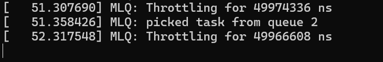

## Experiments

These are experiments to check whether MLQ works correctly. Syscall tests are tested in the earlier section and will not be included in this section.

### Experiment-1 - 3-level MLQ test

* Run a 3-layer MLQ test with 3 loops, assigning each loop to a different priority. 
* Make priority 1 sleep at regular intervals
* `loop_sleep(pid=3092)` process with priority 1 sleeps for 1ms 
* Processes `loop_busy(pid=3093)` and `loop_busy(pid=3094)` with prioritiy 2 and 3, respectively.


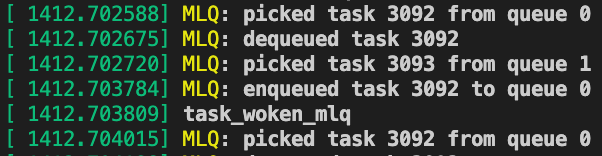

You will see that pid 3094 has no oppotunity to run because pid 3093 is a busy loop and has higher priority.
Pid 3093 can be run as soon as pid 3092 sleeps, which is what we expect.

### Experiment-2 - round-robin test

* Run a round-robin (RR) test with 2 tasks, one for each priority 1 and priority 2, respectively.
* By observing the timestamp from the `printk`, we can confirm that priority 1 and priority 2 have 50/100 ms timeslice respectively.

#### priority 1 time slice

| Teat 1       | Test 2       | Test 3       | Average      |
| ------------ | ------------ | ------------ | ------------ |
| 0.054777 (s) | 0.055102 (s) | 0.054579 (s) | 0.054819 (s) |

#### priority 2 time slice

| Teat 1       | Test 2       | Test 3      | Average     |
| ------------ | ------------ | ----------- | ----------- |
| 0.103892 (s) | 0.104038 (s) | 0.10365 (s) | 0.10386 (s) |

### Experiment-3 - FIFO (Priority 3) tests

* Run a FIFO test with a busy loop, check if it works properly.
* 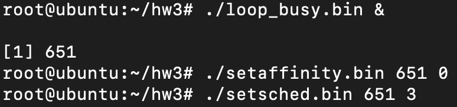
* The task will keep executing without any requeueing as there is no time slice for tasks with priority 3.
* 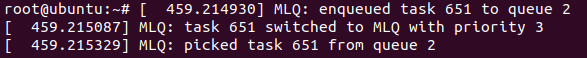


### Experiment-4 - Priority changing tests

* Run two busy loop tasks with priority 1 and priority 2. After a period of time, exchange their priority.
* 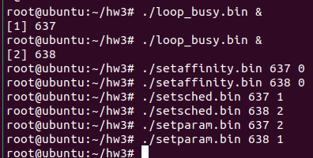
* Observe the task in queue with priority 1 is changed or not.
* 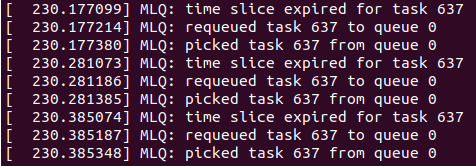
* 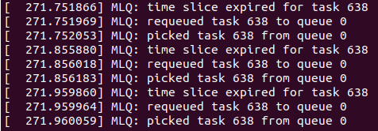

### Experiment-5 - throttling test (bonus)


Experiment setup:

- Run a busy-loop program which contains an infinite loop without any sleeps.
- Run on a VM with only single core.
- `mlq_throttling` is appended to kernel cmdline to enable throttling.

Expected result:

- Tasks in CFS will run laggy but can still run.
- Messeges indicated that throttling is triggered are outputed to the kernel ring buffer.

Steps:

```shell=
$ ./loop &    # Run the busy-loop program in background
[1] 420       # Got the PID of the program

# Use our utility to change the process 420 priority and sched_class to MLQ and priority 3
$ ./setsched.bin 420 3  

$ dmesg       # check the kernel message
```

Result: The system is laggy but not blocked. `dmesg` shows the following message.

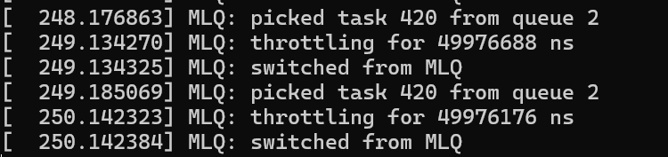

It shows that throttling works.


## Contributions from each group member

王彥傑：

- Cowork with group members to implement the initial version of MLQ scheduler
- Bug fixes of our implementation
- Bonus: MLQ throttling implementation, experiments, and write-up writings.
- Provide some suggestions of how to fix bugs and how we can perform the experiments.
- Fix formating to reduce warnings and errors reported by `checkpatch.pl`

楊卓敏：

- Cowork with group members to implement the initial version of MLQ scheduler.
- Bug fixes of our implementation.
- Implement system call test programs.
- Implement different loop programs for testing.
- Write-up writing for Implementation Details and Test System Call part.

廖盛弘:

- Cowork with group members to implement the initial version of MLQ scheduler
- Bug fixes of our implementation
- apply trace-printk instead of printk
- run two experiments and analysis
